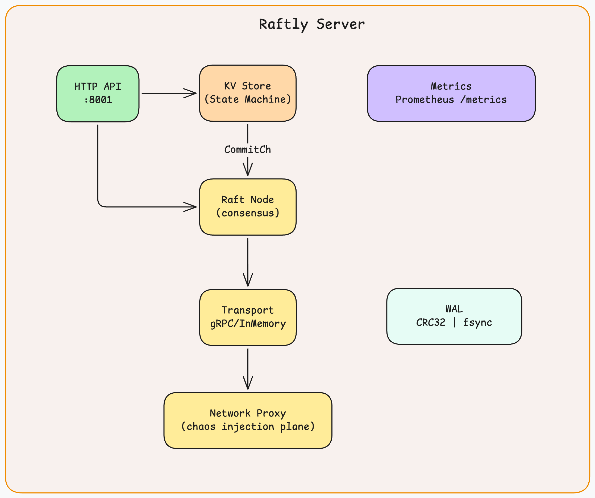

# Raftly

A production-quality Raft consensus implementation in Go: written as a failure-simulation laboratory, not a tutorial.

Most distributed systems guides teach you how things work when they go right. This project teaches what happens when they go wrong: network partitions, WAL corruption, stale leaders, split-brain. Each failure mode is based on a real incident. Each one is reproducible on a laptop in under a minute.

---

## Table of Contents

1. [What This Is](#1-what-this-is)
2. [Architecture](#2-architecture)
3. [What I Deliberately Broke](#3-what-i-deliberately-broke)
4. [Failure Scenarios](#4-failure-scenarios)
5. [Benchmarks](#5-benchmarks)
6. [Implementation Highlights](#6-implementation-highlights)
7. [Running Locally](#7-running-locally)
8. [Dashboard (UI)](#8-dashboard-ui)
9. [Docker Deployment](#9-docker-deployment)
10. [References](#10-references)

---

## 1. What This Is

Raftly is a from-scratch Raft implementation that prioritizes observability and fault injection over performance. The goal is to understand, at the code level, why distributed consensus is hard.

**What it includes:**

- Full Raft consensus: leader election, log replication, pre-vote, fast log backtracking
- Write-ahead log with CRC32 torn-write detection
- In-memory transport with a chaos injection plane (network partitions, packet loss, delay)
- gRPC transport for real multi-node deployment
- A replicated key-value HTTP API (PUT / GET / DELETE)
- Prometheus metrics + Grafana dashboards
- Four reproducible failure scenarios based on real production incidents
- Benchmark suite measuring WAL throughput, proposal latency, and leader election time

**What it is not:**

- A replacement for etcd or Consul
- A complete snapshot/compaction implementation
- A membership change (joint consensus) implementation

---

## 2. Architecture



**Packages:**

| Package      | Responsibility                                                     |
| ------------ | ------------------------------------------------------------------ |
| `raft/`      | Core state machine: election, replication, log, WAL, config        |
| `transport/` | Transport abstraction: gRPC for real clusters, in-memory for tests |
| `chaos/`     | Fault injection: crash, partition, packet loss, delay              |
| `scenarios/` | Reproducible failure scenarios with pass/fail assertions           |
| `server/`    | HTTP API, KVStore state machine, Prometheus metrics                |
| `tests/`     | Integration tests and benchmarks                                   |
| `proto/`     | Protobuf definitions for `RequestVote`, `PreVote`, `AppendEntries` |

**Data flow — proposal to commit:**

```
client → PUT /keys/x
    → KVStore.HandlePut()
        → RaftNode.Propose(data)
        → WAL.SaveEntry() + WAL.Sync()
        → log.Append()
        → maybeSendHeartbeats()   ← triggers immediate AppendEntries, not next tick
        → wait on resultCh
            ← AppendEntries reaches quorum
            ← CommitTo(index) called
            ← notifyProposal(index)
        → return index, term
        → read from CommitCh
        → apply to data map
→ 200 OK
```

---

## 3. What I Deliberately Broke

This section is the point of the project.

Each failure below corresponds to a real incident. For each one, I:

1. Wrote code that exhibits the failure mode
2. Observed the failure
3. Implemented the defense
4. Added a chaos scenario that reproduces it on demand

### Network Partition → Split Brain (AWS, 2011)

**What happens:** A network partition isolates the leader. The majority partition elects a new leader. For a window of time, two nodes believe they are the leader.

**The defense:** Raft's quorum requirement. An isolated leader cannot commit new entries because it cannot reach a majority. Its proposals sit in the log, unacknowledged. When the partition heals, the old leader discovers a higher term and immediately steps down. Its uncommitted entries are overwritten.

**Reproduce it:**

```bash
make scenario NAME=split-brain-2011
```

### Leader Isolation Without Lease (etcd, 2018)

**What happens:** A leader is partitioned but its local clock hasn't expired. It still believes it is the leader and accepts read requests, returning stale data to clients.

**The observation:** Without a lease mechanism, the node continues serving reads from its local state machine. `GET /keys/x` returns the value from before the partition.

**Reproduce it:**

```bash
make scenario NAME=leader-isolation-write-loss
```

### WAL Torn Write

**What happens:** A process crashes mid-`write()`. The OS flushes part of a log record. On restart, the partial record has a valid length but invalid CRC32.

**The defense:** Every WAL record is suffixed with a CRC32 checksum over the record data. `WAL.ReadAll()` stops at the first checksum mismatch and truncates the file at that boundary. All records before the torn write are recovered. All records after are discarded.

**Reproduce it:**

```bash
make scenario NAME=wal-torn-write
```

### Stale Log Elected Leader (etcd, 2018)

**What happens:** A partitioned follower misses 10 log entries. The partition heals. The partitioned node starts an election because its election timer fires first.

**Without the election restriction:** A node with a log at index 10 could be elected over a node at index 20, causing committed entries (11–20) to be overwritten. This is data loss.

**The defense:** Raft's election restriction. A voter rejects any `RequestVote` from a candidate whose log is less up-to-date than the voter's own. The stale node cannot win a majority and cannot become leader.

**Reproduce it:**

```bash
make scenario NAME=stale-log-elected-leader
```

---

## 4. Failure Scenarios

Run all four scenarios:

```bash
make scenarios
```

Run one by name:

```bash
make scenario NAME=split-brain-2011
make scenario NAME=leader-isolation-write-loss
make scenario NAME=wal-torn-write
make scenario NAME=stale-log-elected-leader
```

Each scenario prints a structured result:

```
=== TestChaosSplitBrain ===
PASS
Summary:
  old_leader_term:   3
  new_leader_term:   4
  entries_overwritten: 5
  observation: old leader stepped down at t=318ms
```

| Scenario                      | Real Incident                  | What It Tests                                           |
| ----------------------------- | ------------------------------ | ------------------------------------------------------- |
| `split-brain-2011`            | AWS US-East-1 EBS (April 2011) | Quorum prevents committed data loss on partition        |
| `leader-isolation-write-loss` | etcd network partition (2018)  | Isolated leader cannot commit without quorum            |
| `wal-torn-write`              | Any process crash mid-fsync    | CRC32 detects torn writes; recovery stops at boundary   |
| `stale-log-elected-leader`    | etcd stale read bug (2018)     | Election restriction blocks stale nodes from leadership |

---

## 5. Benchmarks

```bash
make bench
```

Results on a MacBook Pro M3 (single-machine in-memory transport):

```
BenchmarkWALWriteSync-12          2,706,794 ns/op    23.65 MB/s   (2.7ms per fsync)
BenchmarkWALBatchWrite-12         2,381,029 ns/op   268.80 MB/s   (2.4ms per 10-entry batch)
BenchmarkLogAppend-12                 82.81 ns/op                  (in-memory only)
BenchmarkSingleNodePropose-12     2,275,550 ns/op                  (2.3ms, no peers)
BenchmarkThreeNodePropose-12      6,615,942 ns/op                  (6.6ms, 2 AppendEntries RTTs)
BenchmarkConcurrentPropose/c1     6,453,177 ns/op                  (baseline)
BenchmarkConcurrentPropose/c4     4,140,956 ns/op                  (36% faster — group commit)
BenchmarkConcurrentPropose/c16    3,823,897 ns/op                  (41% faster)
BenchmarkConcurrentPropose/c64    3,481,429 ns/op                  (46% faster)
BenchmarkLatencyPercentiles-12    p50=6,730µs  p95=9,903µs  p99=12,411µs
BenchmarkLeaderElectionTime-12    155 ms/election
```

**Key observations:**

**WAL is the bottleneck.** `BenchmarkLogAppend` (82ns) vs `BenchmarkWALWriteSync` (2.7ms), the in-memory log is 32,000× faster than a durable log. Every `Propose()` call pays one `fsync`. This is the correct tradeoff for a system that claims durability.

**Concurrent proposals get faster, not slower.** The naive prediction was that proposals would serialize on disk I/O and throughput would stay flat. The opposite happened: c64 is 46% faster than c1. The reason is opportunistic group commit. When 64 goroutines call `Propose()` simultaneously, they pile up waiting for the mutex. The leader grabs them all, sends one
`AppendEntries` to both followers, and does one `fsync` — then unblocks all 64 callers. This is the same effect that makes Kafka's batching so effective.

**Tail latency is bounded.** p99 (12.4ms) is 1.85× the p50 (6.7ms). That ratio is healthy. Production Raft clusters get worried when p99/p50 exceeds 10×. The tail here is bounded by an occasional heartbeat delay before the final commit acknowledgment arrives.

**Leader election takes one election timeout.** 155ms ≈ the 150ms base election timeout. That means the first follower whose timer fired won in a single round — no vote split, no retry. Real clusters add network RTT and occasionally retry (300–500ms is typical).

---

## 6. Implementation Highlights

### Pre-Vote

Before starting a real election (which increments the term and disrupts the cluster), a candidate first runs a dry-run election: it sends `PreVote` RPCs with `term+1` but does not persist the higher term. Only if a quorum responds positively does the real election begin.

This prevents the common failure mode where a partitioned follower's timer fires repeatedly, incrementing its term to 100 while the cluster is at term 4. When it rejoins, it would force an unnecessary election even though a stable leader exists.

### Fast Log Backtracking

Standard Raft retries AppendEntries one entry at a time on conflict — O(N) round-trips to catch up a lagging follower. This implementation uses the optimization from §5.3 of the Raft paper: the follower includes `ConflictTerm` and `ConflictIndex` in its rejection response. The leader skips back an entire term in one RTT.

### Heartbeat-Driven Commit

When `Propose()` appends an entry, it immediately calls `maybeSendHeartbeats()` rather than waiting for the next heartbeat tick (50ms). This dropped single-node proposal latency from ~50ms to ~2.3ms — a 22× improvement. Without it, every proposal waited up to one full heartbeat interval before followers even knew about the new entry.

### WAL Format

```
[ 4 bytes: record length ][ N bytes: data ][ 4 bytes: CRC32 of data ]
```

Two record types: `walRecordState` (currentTerm + votedFor, written on every term change) and `walRecordEntry` (one log entry). On startup, `ReadAll()` replays records in order. A CRC32 mismatch stops replay at that record and truncates the file there. All records before the torn write are restored. The node rejoins the cluster and catches up via AppendEntries.

### Transport Abstraction

Both `GRPCTransport` (real network) and `InMemTransport` (in-process) implement the same `Transport` interface. All chaos injection, partitions, packet loss, delay, is applied through a `NetworkProxy` that sits between the transport and its callers. Tests run against `InMemTransport` with a `NetworkProxy` in front, so chaos scenarios work identically in tests
and in production.

---

## 7. Running Locally

**Prerequisites:** Go 1.22+

```bash
git clone https://github.com/ani03sha/raftly
cd raftly
```

**Build:**

```bash
make build
# Output: bin/raftly-server
```

**Run all tests:**

```bash
make test
```

**Run short tests only (skip slow chaos tests):**

```bash
make test-short
```

**Run benchmarks:**

```bash
make bench
# Optional filter: make bench WAL
```

**Run a single chaos scenario:**

```bash
make scenario NAME=split-brain-2011
```

**Run all four chaos scenarios:**

```bash
make scenarios
```

**Start a 3-node cluster manually:**

Terminal 1:

```bash
./bin/raftly-server -id node1 -grpc-addr :7001 -http-addr :8001 \
  -peers node2=:7002,node3=:7003 \
  -http-peers node1=:8001,node2=:8002,node3=:8003
```

Terminal 2:

```bash
./bin/raftly-server -id node2 -grpc-addr :7002 -http-addr :8002 \
  -peers node1=:7001,node3=:7003 \
  -http-peers node1=:8001,node2=:8002,node3=:8003
```

Terminal 3:

```bash
./bin/raftly-server -id node3 -grpc-addr :7003 -http-addr :8003 \
  -peers node1=:7001,node2=:7002 \
  -http-peers node1=:8001,node2=:8002,node3=:8003
```

**Write and read:**

```bash
curl -X PUT http://localhost:8001/keys/hello -d '{"value":"world"}'
curl http://localhost:8001/keys/hello
curl http://localhost:8002/keys/hello   # follower proxies to leader
```

**Check node status:**

```bash
curl http://localhost:8001/status
```

---

## 8. Dashboard (UI)

The dashboard is a React app embedded directly in the server binary: no separate process, no build step at runtime. After starting the cluster, open **http://localhost:8001** in a browser.

### Layout

The UI is a fixed three-column viewport. Nothing scrolls at the page level; each column manages its own content.


---

### Left Column: Cluster State

**Health strip** at the top shows four pills that update every 500ms via SSE:

| Pill     | What it shows                                                                   |
| -------- | ------------------------------------------------------------------------------- |
| `health` | `HEALTHY` (green) · `DEGRADED` (amber) · `PARTITIONED` (red) · `CRITICAL` (red) |
| `leader` | Current leader node ID, or `—` if no leader elected                             |
| `term`   | Current Raft term across the cluster                                            |
| `nodes`  | Reachable nodes out of total, e.g. `3/3`                                        |

**Topology SVG** renders all nodes as circles connected by edges:

| Color               | Meaning                                         |
| ------------------- | ----------------------------------------------- |
| Green circle        | Leader                                          |
| Blue circle         | Follower                                        |
| Amber circle        | Candidate (mid-election)                        |
| Red circle          | Down or partitioned                             |
| Green edge          | Healthy replication link (animated from leader) |
| Dashed red edge + ✕ | Partitioned link                                |
| Purple edge         | Delayed link (label shows `Nms`)                |
| Amber edge          | Lossy link (label shows `N%`)                   |

**Node cards** show per-node state, term, and commit index. Cards turn red when a node is down or partitioned.

**Replication log** table shows the last 10 committed entries across all nodes. Green cells = committed; blue cells = replicated but not yet committed. A progress bar at the top shows `commitIndex / lastIndex`.

---

### Center Column: Controls

Four tabs, each with an interactive top section and a contextual explainer below.

#### Scenarios tab

Five pre-built scenarios that automate chaos injection, observation, and healing:

| Scenario               | What it does                                                                       |
| ---------------------- | ---------------------------------------------------------------------------------- |
| **Happy path**         | Writes 5 keys back-to-back; shows clean replication across all nodes               |
| **Leader crash**       | Isolates the leader; remaining majority elects a replacement within ~300ms         |
| **Minority partition** | Isolates one follower; majority keeps committing; isolated node can't win election |
| **Packet loss**        | Injects 40% loss on a follower; commits advance via retries, no election fires     |
| **Slow follower**      | Adds 300ms latency to a follower; leader uses fast peer for quorum                 |

To run: click a scenario tab → read the steps → click **Run scenario**. The button shows a spinner while running. All destructive scenarios auto-heal after the delay configured in Settings.

#### Chaos tab

Manual fault injection with four modes:

| Mode          | What it does                                                                |
| ------------- | --------------------------------------------------------------------------- |
| **Isolate**   | Blackholes all Raft traffic to/from the target node                         |
| **Partition** | Drops traffic between two specific nodes only, all other links stay healthy |
| **Delay**     | Adds `delay ± jitter` ms latency to a node's Raft messages                  |
| **Loss**      | Drops a configurable percentage of packets on a node (slider: 5%–95%)       |

Click **Heal all** at the top of the panel to clear every rule on every node simultaneously. Active rules are shown at the bottom of the panel.

> The chaos proxy intercepts **gRPC (Raft RPC) traffic only**. HTTP calls (KV ops, cluster API, status polling) always pass through — this is why Heal always works even when a node is fully isolated at the Raft level.

#### KV ops tab

Interact directly with the replicated key-value store:

- **PUT** — proposes a write through Raft. The entry appears in the replication log as blue (replicated) then green (committed).
- **GET** — reads from the leader's state machine. Always linearizable — reflects all prior commits.
- **DELETE** — proposes a delete command through the same Raft pipeline as PUT.

If the node you're hitting is not the leader it transparently proxies the request. The "Routed to leader" label at the top shows who handled it.

#### Settings tab

Adjust cluster parameters live — no restart required:

| Setting                | Range     | Effect                                                                                                                                                                     |
| ---------------------- | --------- | -------------------------------------------------------------------------------------------------------------------------------------------------------------------------- |
| **Election timeout**   | 50–2000ms | How long followers wait before starting an election. Default: 150ms. Increasing this makes the cluster more stable; decreasing it makes elections fire faster under chaos. |
| **Heartbeat interval** | 10–500ms  | How often the leader sends AppendEntries. Default: 50ms. Must stay well below election timeout (rule of thumb: `heartbeat ≤ timeout / 5`).                                 |
| **Auto-heal delay**    | 2–30s     | How long Scenarios wait before healing after injecting chaos. Increase this to give more time to observe leader elections. Default: 4s.                                    |

Click **Apply to all nodes** to fan out changes to the entire cluster. The UI validates that heartbeat < election timeout before allowing apply. Click **Reset** to restore defaults.

---

### Right Column: Event Timeline

A live stream of cluster and local events, newest first. Events are color-coded:

| Color     | Event type                            |
| --------- | ------------------------------------- |
| Green     | `leader_change` — new leader elected  |
| Amber     | `term_change` — term incremented      |
| Red       | `node_down` — node became unreachable |
| Blue      | `node_up` — node recovered            |
| Red (dim) | Local chaos injection                 |
| Purple    | Local scenario step                   |
| Grey      | Local KV operation                    |

Cluster events arrive over SSE from the server. Local events (chaos, KV, scenario steps) are generated client-side and merged into the same timeline.

---

## 9. Docker Deployment

Starts a 3-node cluster with the embedded dashboard, Prometheus metrics, and a Grafana dashboard — one command.

```bash
make docker-build
make docker-up
```

| Service            | URL                                 | Notes                                |
| ------------------ | ----------------------------------- | ------------------------------------ |
| **Dashboard (UI)** | **http://localhost:8001**           | Open this — embedded React app       |
| Node 1 API         | http://localhost:8001               | Also accepts raw curl requests       |
| Node 2 API         | http://localhost:8002               | Followers proxy writes to the leader |
| Node 3 API         | http://localhost:8003               |                                      |
| Prometheus         | http://localhost:9090               |                                      |
| Grafana            | http://localhost:3000 (admin/admin) |                                      |

**Grafana dashboard panels:**

- Current Raft term (all nodes)
- Node state (follower=0, candidate=1, leader=2)
- Committed log index (all nodes)
- WAL fsync duration (histogram)
- Replication lag per peer

**Write to the cluster:**

```bash
curl -X PUT http://localhost:8001/keys/foo -d '{"value":"bar"}'
```

**Stop:**

```bash
make docker-down
```

**Tear down metrics:**

```bash
docker compose -f docker/docker-compose.yml down -v
```

---

## 10. References

**Papers:**

- [In Search of an Understandable Consensus Algorithm (Extended Version)](https://raft.github.io/raft.pdf) — Ongaro & Ousterhout, 2014
- [Paxos Made Simple](https://lamport.azurewebsites.net/pubs/paxos-simple.pdf) — Lamport, 2001

**Incident Reports:**

- [Summary of the Amazon EC2 and Amazon RDS Service Disruption in the US East Region (April 21-24, 2011)](https://aws.amazon.com/message/65648/) — The EBS split-brain incident
- [etcd: a distributed key-value store — post-mortem issues](https://github.com/etcd-io/etcd/issues?q=label%3Abug+stale) — etcd stale read
  and election bugs

**Books:**

- _Designing Data-Intensive Applications_ — Martin Kleppmann (Chapter 9: Consistency and Consensus)
- _Database Internals_ — Alex Petrov (Chapter 14: Consensus Protocols)

**Related Projects:**

- [etcd/raft](https://github.com/etcd-io/etcd/tree/main/raft) — Production Raft library
- [hashicorp/raft](https://github.com/hashicorp/raft) — Used in Consul and Vault
- [MIT 6.824 Labs](https://pdos.csail.mit.edu/6.824/) — Distributed systems course

---

_Built as a learning exercise to understand what production consensus algorithms get wrong — and
how they recover._

---
